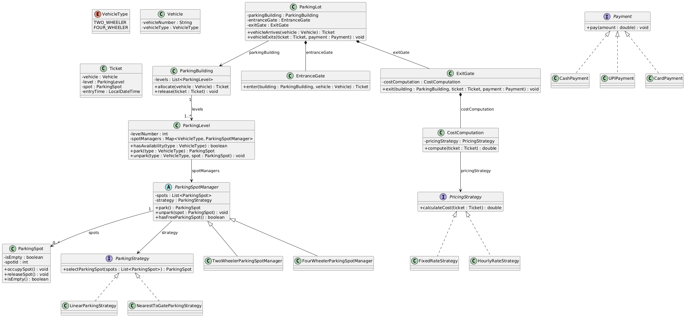
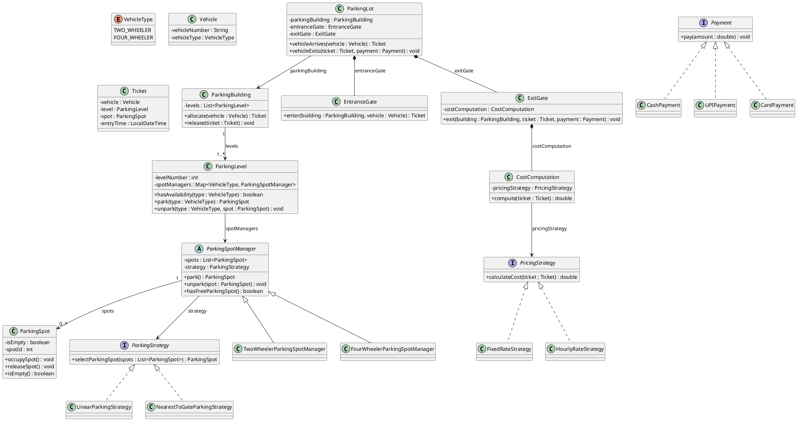

# Parking Lot Management System

A comprehensive Low-Level Design (LLD) implementation of a Parking Lot Management System in Java. This project demonstrates the application of various design patterns and SOLID principles to create a scalable, maintainable, and extensible parking management solution.

## 📋 Table of Contents

- [Overview](#overview)
- [Features](#features)
- [Architecture](#architecture)
- [Design Patterns](#design-patterns)
- [Project Structure](#project-structure)
- [UML Diagram](#uml-diagram)
- [How to Compile and Run](#how-to-compile-and-run)
- [Usage Examples](#usage-examples)

## 🎯 Overview

This Parking Lot Management System handles the complete lifecycle of vehicle parking:
- **Vehicle Entry**: Vehicles arrive and are assigned parking spots based on their type (Two-Wheeler or Four-Wheeler)
- **Spot Management**: Different strategies for selecting parking spots (Linear or Nearest to Gate)
- **Multi-Level Support**: Parking building with multiple levels, each containing spots for different vehicle types
- **Cost Calculation**: Flexible pricing strategies (Fixed Rate or Hourly Rate)
- **Payment Processing**: Multiple payment methods (Cash, UPI, Card)
- **Vehicle Exit**: Automated exit process with cost calculation and payment

## ✨ Features

- **Vehicle Type Support**: Handles Two-Wheeler and Four-Wheeler vehicles
- **Flexible Spot Selection**: Multiple parking strategies (Linear, Nearest to Gate)
- **Multi-Level Parking**: Support for parking buildings with multiple levels
- **Dynamic Pricing**: Configurable pricing strategies (Fixed Rate, Hourly Rate)
- **Multiple Payment Methods**: Cash, UPI, and Card payment options
- **Ticket-Based System**: Each vehicle receives a ticket with entry details
- **Extensible Design**: Easy to add new vehicle types, strategies, pricing models, and payment methods

## 🏗️ Architecture

The system is organized into several key components:

### Core Entities
- **VehicleType**: Enum defining vehicle categories
- **Vehicle**: Represents a vehicle with number and type
- **ParkingSpot**: Individual parking spot with occupancy status
- **Ticket**: Contains vehicle, level, spot, and entry time information

### Parking Management
- **ParkingStrategy**: Interface for spot selection algorithms
- **ParkingSpotManager**: Abstract manager for parking spots with strategy pattern
- **ParkingLevel**: Manages multiple spot managers for different vehicle types
- **ParkingBuilding**: Contains multiple levels and handles allocation/release

### Entry/Exit Flow
- **EntranceGate**: Handles vehicle entry and ticket generation
- **ExitGate**: Manages exit process with cost computation and payment

### Pricing & Payment
- **PricingStrategy**: Interface for cost calculation algorithms
- **CostComputation**: Computes parking costs using pricing strategy
- **Payment**: Interface for payment processing methods

### Main Orchestrator
- **ParkingLot**: Main class that coordinates all components

## 🎨 Design Patterns

This project implements several key design patterns:

### 1. **Strategy Pattern**
   - **ParkingStrategy**: Different algorithms for selecting parking spots
     - `LinearParkingStrategy`: Selects first available spot
     - `NearestToGateParkingStrategy`: Selects spot closest to entrance
   - **PricingStrategy**: Different cost calculation methods
     - `FixedRateStrategy`: Fixed cost regardless of time
     - `HourlyRateStrategy`: Cost based on parking duration
   - **Payment**: Different payment processing methods
     - `CashPayment`, `UPIPayment`, `CardPayment`

### 2. **Factory Pattern**
   - **ParkingSpotManager**: Abstract factory for creating vehicle-specific managers
     - `TwoWheelerParkingSpotManager`
     - `FourWheelerParkingSpotManager`

### 3. **Composition Pattern**
   - `ParkingLot` composes `EntranceGate` and `ExitGate`
   - `ParkingBuilding` composes multiple `ParkingLevel` objects
   - `ParkingSpotManager` composes multiple `ParkingSpot` objects

### 4. **Template Method Pattern**
   - `ParkingSpotManager` defines the template for parking/unparking operations

## 📁 Project Structure

```
ParkingLot/
├── Core/                          # Core domain entities
│   ├── VehicleType.java          # Vehicle type enum
│   ├── Vehicle.java              # Vehicle entity
│   ├── ParkingSpot.java          # Parking spot entity
│   └── Ticket.java               # Parking ticket
│
├── Strategy/                      # Parking spot selection strategies
│   ├── ParkingStrategy.java      # Strategy interface
│   ├── LinearParkingStrategy.java
│   └── NearestToGateParkingStrategy.java
│
├── Manager/                       # Parking spot managers
│   ├── ParkingSpotManager.java    # Abstract manager
│   ├── TwoWheelerParkingSpotManager.java
│   └── FourWheelerParkingSpotManager.java
│
├── Level/                         # Parking level and building
│   ├── ParkingLevel.java
│   └── ParkingBuilding.java
│
├── Gate/                          # Entry and exit gates
│   ├── EntranceGate.java
│   └── ExitGate.java
│
├── Pricing/                       # Pricing strategies
│   ├── PricingStrategy.java      # Pricing interface
│   ├── FixedRateStrategy.java
│   ├── HourlyRateStrategy.java
│   └── CostComputation.java
│
├── Payment/                        # Payment methods
│   ├── Payment.java               # Payment interface
│   ├── CashPayment.java
│   ├── UPIPayment.java
│   └── CardPayment.java
│
├── ParkingLot.java                # Main orchestrator
├── ParkingLotDemo.java            # Demo/Test class
└── README.md                      # This file
```

## 📊 UML Diagram

### Class Diagram

The system architecture is represented by the following UML class diagram:



### PlantUML Source Code



### UML Diagram Relationships

- **Inheritance** (`<|--`): `TwoWheelerParkingSpotManager` and `FourWheelerParkingSpotManager` extend `ParkingSpotManager`
- **Implementation** (`<|..`): Strategy classes implement their respective interfaces
- **Composition** (`*--`): Strong ownership (e.g., `ParkingLot` composes `EntranceGate` and `ExitGate`)
- **Association** (`-->`): Reference relationships (e.g., `ParkingSpotManager` uses `ParkingStrategy`)

## 🚀 How to Compile and Run

### Prerequisites
- Java JDK 8 or higher
- Terminal/Command Prompt

### Compilation

Navigate to the project directory and compile all Java files:

```bash
cd ParkingLot

javac Core/*.java Manager/*.java Strategy/*.java Level/*.java Gate/*.java Pricing/*.java Payment/*.java *.java
```

### Execution

Run the demo class:

```bash
java ParkingLotDemo
```


## 🔧 Extensibility

The system is designed to be easily extensible:

- **New Vehicle Types**: Add to `VehicleType` enum and create corresponding manager
- **New Parking Strategies**: Implement `ParkingStrategy` interface
- **New Pricing Models**: Implement `PricingStrategy` interface
- **New Payment Methods**: Implement `Payment` interface
- **Additional Levels**: Add more `ParkingLevel` objects to `ParkingBuilding`

## 📝 Notes

- The `HourlyRateStrategy` calculates cost based on 30-minute intervals at Rs 50 per interval
- The `FixedRateStrategy` charges a flat rate of Rs 100
- Parking spots are identified by unique spot IDs
- Each ticket contains entry time for cost calculation
- The system supports multiple levels, each with separate spot managers for different vehicle types

---

**Happy Coding! 🚗🅿️**
