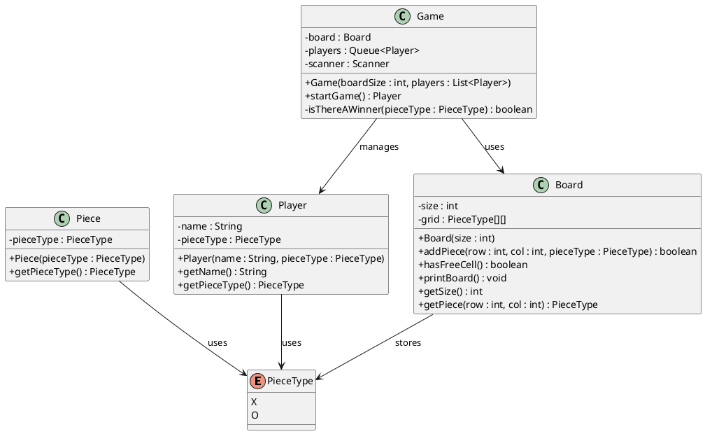

# Tic-Tac-Toe (LLD)

A Low-Level Design implementation of Tic-Tac-Toe in Java: two players (X and O), turn-based moves on a configurable board, win/draw detection.

## Structure

| Component | Role |
|-----------|------|
| **PieceType** | Enum: `X`, `O` |
| **Piece** | Wraps a `PieceType` |
| **Player** | Name + assigned `PieceType` |
| **Board** | Grid, add piece, free cells, win checks, print |
| **Game** | Runs the loop: current player, move input, winner/draw |

## Class diagram (PlantUML)



To render: use a [PlantUML](https://plantuml.com/) viewer or save the block as a `.puml` file.

## Build & run

From `LLDQuestions` (with `tictactoe` symlink and `out` dir in place):

```bash
cd LLDQuestions
mkdir -p out
ln -sf TicTacToe tictactoe   # if not already done

javac -d out tictactoe/model/*.java
javac -d out -cp out TicTacToe/TicTacToeDemo.java
java -cp out TicTacToeDemo
```

Moves are 0-indexed row and column when prompted (e.g. `1` then `1` for center on a 3×3 board).
